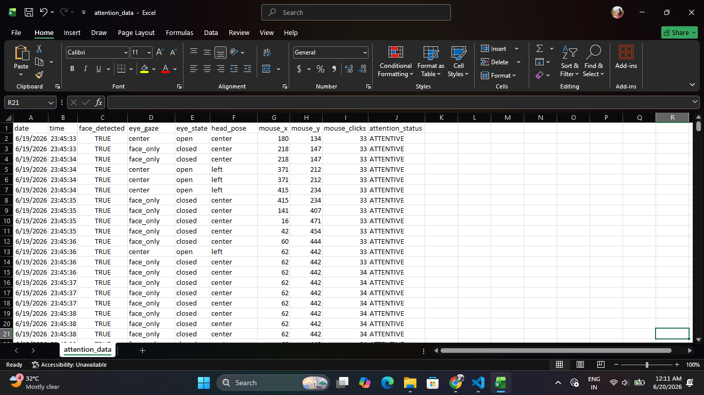
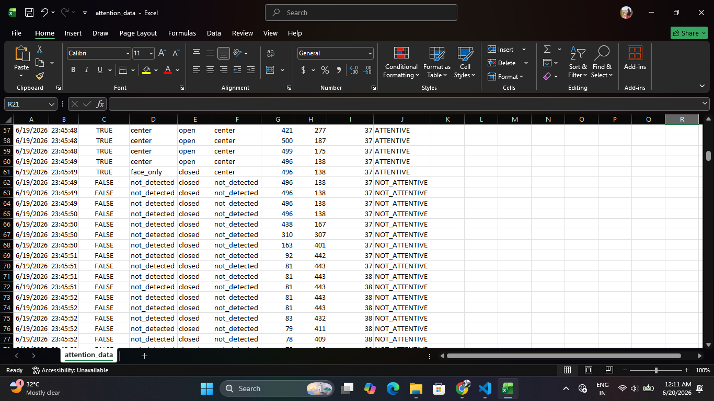
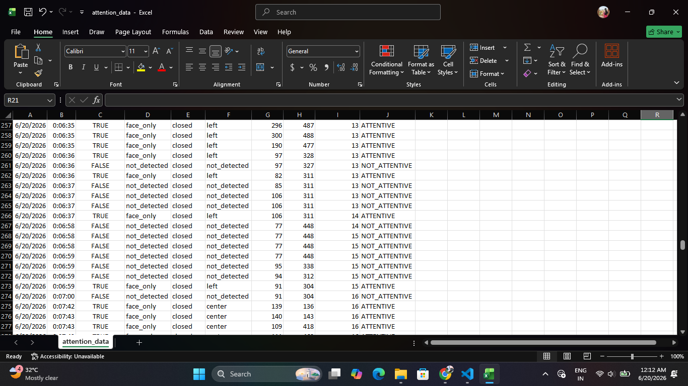

# CursorCam-Attention-Tracker
# 🎯 CursorCam: ML-Based Attention and Engagement Tracker

## 📋 Project Description

CursorCam is an AI-powered Attention and Engagement Tracking System developed as a Final Year Bachelor of Engineering (Computer Science & Engineering - Artificial Intelligence & Machine Learning) Major Project.

The system combines computer vision techniques and user interaction analytics to monitor attention levels in real-time. By analyzing webcam-based facial cues and mouse interaction patterns, CursorCam classifies users as **ATTENTIVE** or **NOT ATTENTIVE** and provides actionable insights through an interactive analytics dashboard.

### 🔍 Key Objectives

- Monitor user attention in real-time using webcam analysis
- Track mouse activity and interaction behavior
- Detect engagement using facial and behavioral features
- Generate visual analytics for attention monitoring
- Support digital learning and online assessment environments
- Provide intelligent attention prediction using Machine Learning

### 🎯 Target Applications

- Online Learning Platforms
- Smart Classrooms
- E-Learning Analytics
- Student Engagement Monitoring
- Remote Training Programs
- Educational Research

---

# 🌟 Key Highlights

## 🧠 Intelligent Attention Detection

### ✅ Real-Time Face Detection

- Continuous webcam monitoring
- Face presence verification

### ✅ Eye Gaze Tracking

- Center, left, right gaze detection
- Focus measurement

### ✅ Head Pose Analysis

- Head orientation tracking
- Engagement estimation

### ✅ Mouse Behavior Monitoring

- Cursor movement tracking
- Mouse click analysis
- Activity pattern detection

---

## 📊 Interactive Analytics Dashboard

### ✅ Attention Trend Visualization

- Real-time attention analytics
- Interactive performance graphs
- Engagement monitoring

### ✅ Educational Support Modules

- 🎥 Learning Videos
- 📚 Study Notes
- 📝 Assessment Module
- 📈 Analytics Dashboard

---

## 🔬 Machine Learning Integration

### ✅ Attention Classification Model

- Random Forest Classifier
- Feature Fusion Approach
- Confidence-Based Predictions

### ✅ Multimodal Analysis

- Facial Features
- Eye Gaze Data
- Head Pose Features
- Mouse Interaction Data
- Behavioral Activity Patterns

---

# 🛠️ Technology Stack

### Frontend


### Machine Learning


### Computer Vision


### Data Processing


### Tracking & Analytics


### Development Tools


# 📸 Project Screenshots

### 📈 Analytics Dashboard


Visualizes attention scores, engagement trends, and learning behavior through interactive graphs.


### 🎥 Learning Videos


Provides educational video resources that help users learn concepts while their attention level is monitored in real-time.

---

## 📚 Study Notes


Displays academic notes and learning materials for students.

---

### 📝 Assessment Module


Interactive quiz-based assessment system used to evaluate user understanding and engagement.

---

## 📊 Attention Dataset Samples







**Caption:** Displays sample records from the generated attention dataset containing facial features, eye gaze direction, eye state, head pose information, mouse activity, and attention labels. These records are used for training and evaluating the machine learning model for real-time attention classification.

---


# 📁 Project Structure

```text
CursorCam Project/
│
├── app.py
├── pages/
├── utils/
├── data/
├── logs/
├── outputs/
├── screenshots/
├── requirements.txt
└── README.md
```
---

# ⚙️ Installation Guide

## Requirements

- Python 3.10+
- Webcam
- Windows 10/11

## Clone Repository

```bash
git clone https://github.com/kajal-kupale/CursorCam-Attention-Tracker.git
cd CursorCam-Attention-Tracker
```

## Install Dependencies

```bash
pip install -r requirements.txt
```

## Run Application

```bash
streamlit run app.py
```


# 📜 License

This project is developed for academic and educational purposes.
